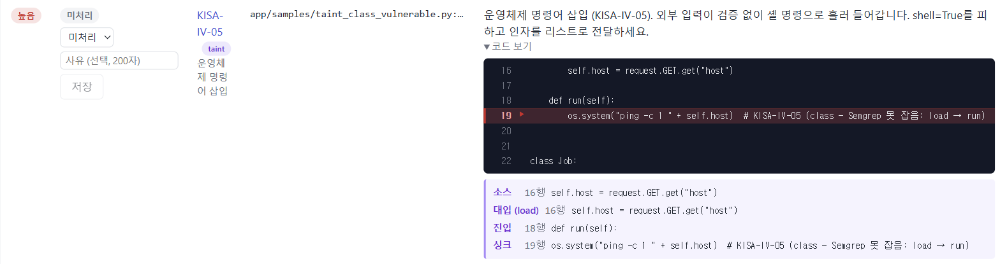
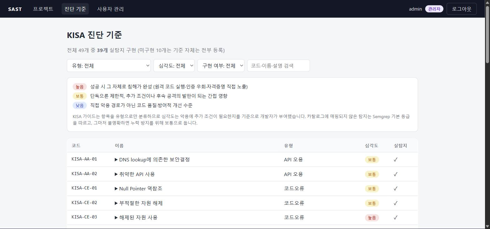
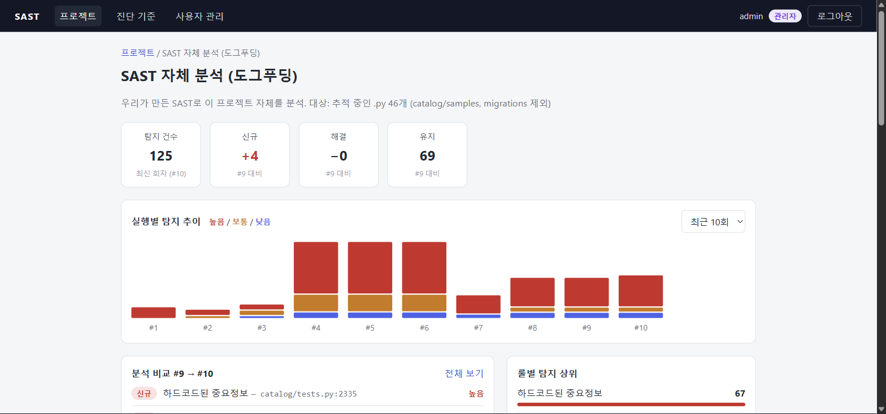
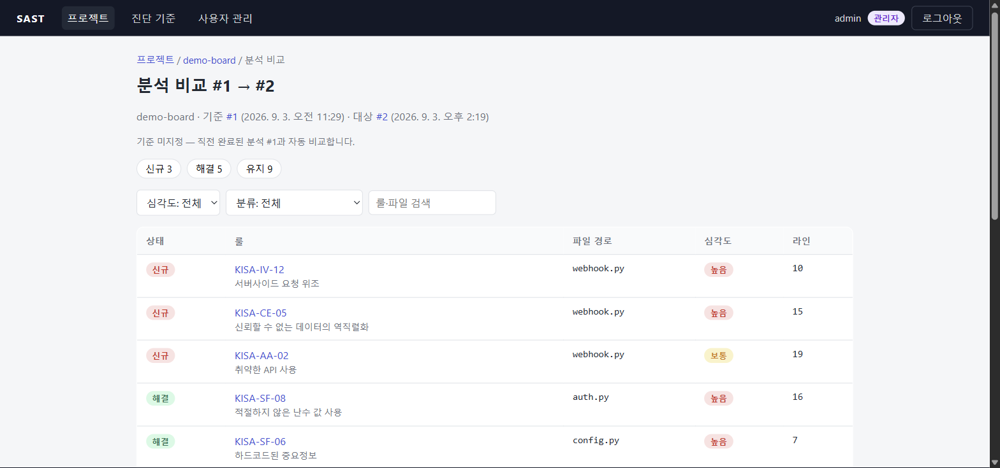
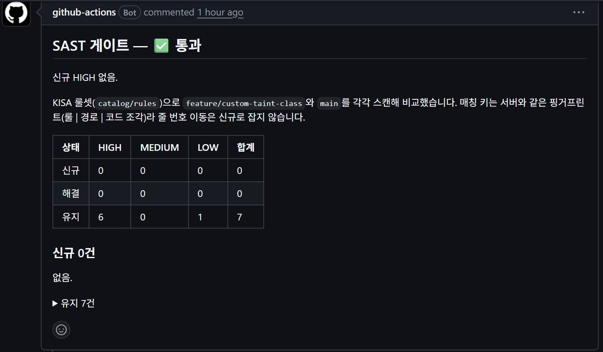
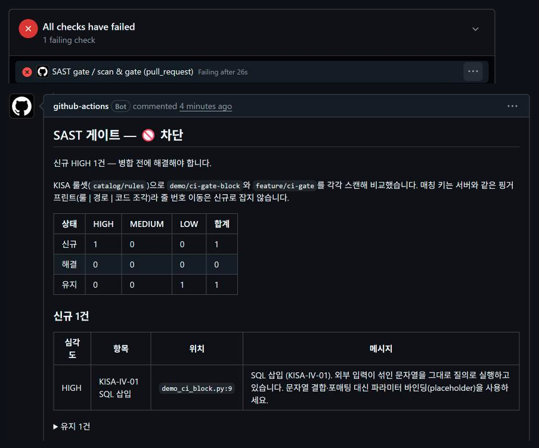

# SAST — KISA 개발보안 가이드 기반 정적 분석 웹 시스템

소스코드 zip을 올리면 KISA 소프트웨어 개발보안 가이드 **49개 진단 기준**으로 정적 분석하고, 결과를 프로젝트
안에 회차로 쌓아 **이전 실행과 비교**하는 웹 시스템. 엔진은 Semgrep 위에 자체 룰 100개(4개 언어)를 얹었고,
Semgrep 무료 엔진이 못 하는 **함수 간·클래스 필드 경유 흐름 추적**은 1,120줄짜리 자체 taint 엔진이 맡음.
Django + DRF / React / PostgreSQL.

실행 방법은 [docs/setup.md](docs/setup.md)에 있음.

*실행 상세 화면. 한 메서드에서 `self.host`에 넣은 입력이 다른 메서드의 `os.system`까지 흐른 경로를 보여줌 —
Semgrep OSS는 이 케이스를 잡지 못함.*

## 이 프로젝트가 하는 일

**진단** — Python·C·Java·JavaScript/TypeScript 룰 100개로 49개 기준 중 39개를 실탐지함. KISA 가이드에는
심각도가 없어서 "성공하면 그 자체로 침해가 완성되는가"를 기준으로 높음 26 / 보통 20 / 낮음 3을 직접 부여했고,
카탈로그 화면에서 항목별 구현 여부와 근거를 봄. Python 인젝션 7항목은 패턴이 아니라 taint(흐름) 룰이라
상수만 흐르면 잡지 않고, 검증(정규식·allowlist·타입 변환)을 거친 값은 깨끗한 것으로 봄.

**권한과 격리** — 관리자/일반 역할, 프로젝트별 사용자 할당. 할당되지 않은 프로젝트는 존재 자체가 드러나지
않음(404로 통일). 업로드된 zip은 실행마다 격리된 디렉토리에서만 다루고, Zip Slip·심볼릭 링크·zip bomb을
막음. 비밀번호는 bcrypt, 인증은 JWT(refresh rotation + blacklist).

**회차 비교와 오탐 관리** — 실행 이력이 프로젝트 안에 회차로 쌓이고, 결과마다 라인 번호를 뺀 핑거프린트를 붙여
다음 회차와 **신규 / 해결 / 유지**로 짝지음. 관리자가 오탐·수용으로 판정하면 다음 회차의 같은 결과에 자동
승계되고 비교에서 빠짐. 대시보드는 회차별 심각도 추이와 룰 상위를 보여줌.

**자체 taint 엔진** — Semgrep OSS taint는 함수 안에서만 흐름을 봄. `analysis/taint`는 Python `ast`만으로
같은 파일 안 함수 간(함수 요약을 고정점까지)과 클래스 필드 경유(한 메서드에서 `self.f = 입력`, 다른 메서드에서
싱크)를 추적하고, 결과를 Semgrep과 (항목·파일·줄)로 병합함. "Semgrep만 잡은 건수"가 실행마다 기록되어 두
엔진의 동등성이 깨지면 바로 드러남.

**분석 큐** — 분석은 Django 6.1 내장 Tasks 큐(PostgreSQL 테이블)에 등록되고 워커가 처리함. Redis 같은 별도
서비스는 없음.

**CI 게이트** — PR마다 GitHub Actions가 base와 head를 우리 룰셋으로 스캔해 서버와 같은 핑거프린트로 비교하고, **신규 HIGH가 1건이라도
있으면 병합을 막음.** main은 이 체크를 필수로 요구함.

## Semgrep OSS 대비 — 넘은 것 / 남은 것

Semgrep 1.175.0 OSS taint 모드를 직접 실측한 뒤(`docs/decisions.md` 2026-09-06 taint) 자체 엔진을 세 단계로
만듦. 각 단계의 성과는 취약/안전 샘플로 숫자를 고정해 테스트가 지킴 — **N** = 우리만 잡는 건수,
**M** = Semgrep이 안전 샘플에서 내는 오탐 중 우리가 내지 않는 건수.

| 흐름 | Semgrep OSS taint | 자체 엔진 | 실측 |
|---|---|---|---|
| 함수 안 변수·f-string·체인 전파, 선언한 sanitizer | 잡음 | 잡음 (1단계) | 동등성: 샘플 15건 일치, 자체 저장소 6/6 |
| 같은 파일 안 함수 간 (헬퍼로 넘긴 입력, 헬퍼가 반환한 입력) | **못 잡음** | 잡음 (2단계) | N = 4, M = 5 |
| 본문이 씻는 헬퍼·메서드 (`my_escape(x)`, `self.quote(x)`) | 오탐 (이름 규약으로만 신뢰) | 본문을 보고 깨끗하게 판정 | M에 포함 |
| 클래스 필드 경유 (`load()`에서 `self.q = 입력`, `run()`에서 싱크) | **못 잡음** | 잡음 (3단계, `__init__` 인자·필드 체인 포함) | N = 5, M = 1 |
| 오염 경로 출력 | 텍스트만 (JSON·SARIF 없음) | 결과에 직접 (소스→호출/진입/반환/대입→싱크) | 화면 표시 |
| 파일 간 (import 해석) | 못 잡음 | **범위 밖** | — |
| 호출 순서·경로 민감도, 전역·클로저, 상속 | 못 잡음 | **범위 밖** (필드는 흐름 비민감) | Django 906파일 실측: 순서 오탐 0 |

실코드에서도 확인함 — 이 저장소를 자기 자신으로 분석한 회차에서 자체 엔진이 컴프리헨션을 거친 `read_text`
1건을 Semgrep보다 더 잡았고, 반대로 괄호 식 수신자(`(A / name).read_text()`) 5건은 Semgrep만 잡아 알려진 한계로
기록함(`docs/worklog.md` 2026-09-07).

## 설계에서 판단한 것 5가지

기각한 대안과 실측 숫자까지 `docs/decisions.md`에 199건을 남김. 그중 이 제품의 모양을 정한 다섯 가지:

1. **심각도는 "추가 조건 없이 침해가 완성되는가"로 3단계.** KISA는 유형만 분류하고 등급을 주지 않는다. 높음 =
   원격 코드 실행·인증 우회·자격증명 직접 노출, 보통 = 사용자 상호작용·타이밍 같은 조건이 더 필요하거나 영향이
   정찰·가용성에 그침, 낮음 = 단독으로는 공격 경로가 아님. 카탈로그에 없는 탐지는 Semgrep 등급, 그마저 없으면
   누락 방지를 위해 보통. — decisions 2026-08-27 (catalog 앱)
2. **미할당 프로젝트는 존재하지 않는 것으로 답한다.** 일반 사용자가 미할당·미존재 프로젝트를 읽으면 완전히
   같은 404, 쓰기는 권한 검사가 객체 조회보다 먼저라 403. 할당을 해제하면 즉시 404가 되어 "있는데 못 보는"
   상태를 남기지 않는다. — decisions 2026-08-27
3. **핑거프린트에 라인 번호를 넣지 않는다.** sha256(룰 | 경로 | 공백 정규화한 코드 조각)에 같은 run 안 순번을
   *항상* 붙인다. 라인을 넣으면 한 줄만 밀려도 전부 신규/해결이 되고, 순번을 중복일 때만 붙이면 중복이 2→1로
   줄어드는 순간 생존자의 키가 바뀌어 건수 자체가 틀린다. 주변 줄을 해시에 넣는 안, 이전 실행을 참조하는 안은
   기각. — decisions 2026-09-02
4. **오탐 승계는 "같은 run의 판정(OPEN 포함) > 직전 실행의 비-OPEN 판정".** 재표준화는 결과를 지우고 다시 넣으므로
   지우기 전에 판정을 핑거프린트별로 모아 두었다가 먼저 입힌다. OPEN까지 포함하는 이유는 관리자가 승계된 오탐을
   되돌린 뒤 재표준화했을 때 되돌림이 조용히 취소되지 않게 하려는 것. 한 트랜잭션이라 멱등. — decisions
   2026-09-05 (오탐 관리)
5. **Celery + Redis를 쓰지 않는다.** 부하는 "관리자가 가끔 누르는 분석, 건당 수십 초~10분"이고 필요한 건
   큐·워커·중복 방지·테스트용 동기 모드 넷뿐이다. Celery·RQ·huey·django-q2와 비교해 Django 6.1 내장
   `django.tasks` + DB 백엔드를 택했다 — 새 패키지 1개, 새 서비스 0개, 테스트는 코어의 `ImmediateBackend`.
   Celery가 필요해지면 바꿀 곳 세 군데를 적어 두었다. — decisions 2026-09-06 (백그라운드 큐)

설계 단계의 우려가 실측으로 뒤집힌 사례도 두 번 있음 — 2단계에서 함수 요약이 패스마다 커지기만 한다고
봤는데 실제로는 진동했던 것, 3단계 흐름 비민감의 오탐 비용이 Django 906파일에서 호출 순서 오탐 0으로 나온 것. 둘 다 decisions에 과정째
남김.

## 숫자로 보는 저장소

| 항목 | 값 |
|---|---|
| KISA 진단 기준 | 49 등록, **39 실탐지** |
| 룰 | **100** — Python 22 (taint 7 포함) · C 13 · Java 35 · JS/TS 30 |
| 지원 확장자 | `.py` `.c` `.h` `.java` `.js` `.jsx` `.ts` `.tsx` |
| 테스트 | **430** (accounts 56 · projects 51 · analysis 121 · catalog 189 · CI 게이트 13), 실제 Semgrep을 도는 시험 22 |
| 화면 | 7 — 로그인 · 프로젝트 목록 · 프로젝트 상세(대시보드) · 실행 상세 · 분석 비교 · 진단 기준 · 사용자 관리 |
| API | 19 엔드포인트, Django 앱 4개 (accounts · projects · analysis · catalog) |
| 자체 taint 엔진 | 1,120줄 (`analysis/taint`) |
| 기록 | 결정 199건 · 요구사항 50/50 |

## 작업 방식

구현에는 Claude Code를 썼고, 설계 판단과 검증 기준은 아래 규칙과 기록으로 통제함.

- **규칙을 문서로 고정.** `CLAUDE.md`에 보안 규칙(bcrypt, IDOR 재검증, Zip Slip, 실행별 격리,
  존재 은닉, 시크릿 금지)과 작업 규칙(설계부터 제시, 한 번에 한 기능, 새 의존성은 승인,
  요구사항 번호를 커밋에)을 적어 두고 매번 이 파일부터 확인함.
- **기능 하나 = 브랜치 하나.** 설계 → 구현 → 테스트 → PR → SAST 게이트 → 병합. 룰은
  스크래치에서 취약/안전 샘플로 정탐·오탐을 실측한 뒤에야 저장소로 옮기고, 기대 건수를
  테스트가 고정함.
- **결정은 근거와 함께.** `docs/decisions.md`에 채택한 것뿐 아니라 기각한 대안, 실측 숫자,
  사고(`.env`가 zip에 섞인 일, `--project-root` 누락)와 재발 방지를 남김. 요구사항 50개는
  `docs/requirements-map.md`가 구현 위치까지 추적하고, `docs/worklog.md`가 일자별 기록.
- **자기 코드를 자기 도구로.** 이 저장소를 도그푸딩 프로젝트로 10회 분석함. 오탐 관리,
  분석 제외 경로, `.env` 사고 처리, 자체 엔진의 결함 둘(헤더 식 호출 누락, 요약 키 소실)이
  전부 여기서 나옴.

## 실행 방법

로컬 실행(터미널 3개), 테스트, CI 게이트 로컬 재현은 [docs/setup.md](docs/setup.md)에 있음.

## 더 읽을 것

- `docs/decisions.md` — 설계 결정 199건 (앞의 목차로 절을 찾음)
- `docs/requirements-map.md` — RFP 요구사항 50개 + 자체 개선 항목의 구현 상태
- `docs/worklog.md` — 일자별 작업 기록
- `docs/plan.md` — 킥오프 계획(요구사항 해석·비목표·일정)
- `docs/self-scan-20260828.md` — 첫 도그푸딩 보고서(8/28 시점)
- `CLAUDE.md` — 프로젝트 규칙
